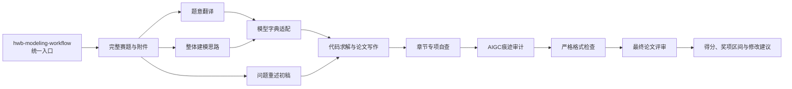

# HWB Math Modeling Skills

面向**"华为杯"中国研究生数学建模竞赛（研赛）**完整流程的 Skills 合集，支持 **Codex** 与 **Claude Code**。

本项目以一个总控 Skill 为统一入口，覆盖赛题逐句理解、全局建模思路生成、模型适配性判断、论文分章节自查、AIGC 痕迹审计、全文格式检查、评委式综合评审、"数模之星"冲刺定位和历届真题标定。

相关规则主要基于 **2020—2025 年中国研究生数学建模竞赛（第十七至二十二届）的 36 道真题**、官方《竞赛通知》与《论文格式规范》、竞赛硬性提交要求，以及本地收录的 **229 篇历年优秀论文**（含第十八届"数模之星"提名奖论文 12 篇）整理而成，并结合研究生阶段论文写作规范、模型字典和历届获奖比例持续更新。

> 本项目不是竞赛官方工具。模型建议、论文评分、位次预测和备赛判断均为辅助参考，最终以当届组委会发布的正式《竞赛通知》《论文格式规范》与实际评审结果为准。
> 赛事规则的权威表述见 [`数模资料/官方文件/华为杯赛事事实基准.md`](数模资料/官方文件/华为杯赛事事实基准.md)。

## 快速开始

如果不确定应该调用哪个 Skill，直接使用总控入口：

```text
调用 $hwb-modeling-workflow。

当前阶段：刚拿到题目
赛题：<赛题文件或路径>
附件：<附件文件或路径，可选>

请识别当前阶段，并按华为杯数学建模完整工作流安排下一步。
```

总控 Skill 会识别当前阶段，选择需要调用的专项 Skill，记录阶段产物并给出下一步操作；不会在没有必要时机械运行全部检查。

## 华为杯关键事实（速查）

| 项目 | 内容 |
|---|---|
| 赛事全称 | "华为杯"中国研究生数学建模竞赛（研赛） |
| 主办 | 中国学位与研究生教育学会、中国科协青少年科技中心（教育部学位管理与研究生教育司指导） |
| 秘书处 | 东南大学 |
| 冠名赞助 | 华为技术有限公司 |
| 官方平台 | "研创网" `https://cpipc.acge.org.cn` |
| 组队 | 每队 **3 人**，专业不限；除当年级新生外不得跨校/跨培养单位组队 |
| 报名费 | **300 元/队** |
| 赛程 | **四天**（2026 年第二十三届：9-23 08:00 → 9-27 12:00） |
| 题量 | **A~F 共 6 题**，源自工程技术与管理科学的实际问题 |
| 获奖比例上限 | 一等 **1.5%**、二等 **13%**、三等 **20%**（合计 ≈34.5%） |
| 特色荣誉 | **"数模之星"** 冠/亚/季军 + 提名奖（每题 2 队、至少 12 队答辩）；**华为专项奖**（华为赛题前 16 名） |
| 提交方式 | **MD5 码 → 上传 PDF 论文 → 上传附件（可选，≤50MB）** 三步分时段 |
| 论文命名 | `试题编号 + 队伍编号`，如 `A24000010001.pdf` |
| 匿名要求 | 首页封皮不可删除且 **4 个图标不可替换**；**除首页外禁止出现单位、姓名、队伍编号** |
| AI 政策 | **可用作辅助工具，不得作为主导手段**，且引用 AI 产品**必须注明来源** |

> 完整规则、时间线与奖金标准见 [`数模资料/官方文件/`](数模资料/官方文件/)。

## Skills 总览

### 零、集成与总控类

| Skill | 作用 | 输入 | 输出 |
|---|---|---|---|
| [`hwb-modeling-workflow`](skills/总控类/hwb-modeling-workflow/) | 识别竞赛阶段并统一调度读题、建模、写作、自查和终稿评审 | 当前阶段，以及已有赛题、附件、数据、思路、论文、代码或检查报告 | 调用计划、阶段产物索引、去重问题清单、下一步建议和流程进度 |

### 一、生成类

| Skill | 作用 | 输入 | 输出 |
|---|---|---|---|
| [`hwb-problem-translator`](skills/生成类/hwb-problem-translator/) | 逐句解释赛题，识别定义、约束、数据口径、交付要求和跨问关系 | 完整赛题及附件说明 | Markdown 题意翻译报告、遗漏审计和跨问题联动图 |
| [`hwb-modeling-ideas`](skills/生成类/hwb-modeling-ideas/) | 从全题角度生成贯穿全文的建模主线，并比较每一问的候选模型 | 完整赛题、附件；可选题意翻译报告 | 问题分析、多模型对比、推荐方案、选型理由、创新与验证建议 |
| [`hwb-problem-restatement`](skills/生成类/hwb-problem-restatement/) | 生成问题重述初稿，也可检查用户已有的问题重述 | 完整赛题；自查模式另提供已有重述 | 问题背景、问题回顾、研究综述，或问题重述诊断报告 |
| [`hwb-ai-usage-disclosure`](skills/生成类/hwb-ai-usage-disclosure/) | 根据真实使用情况生成或检查 AI 工具使用声明与使用详情 | 论文、真实 AI 使用记录；可选已有披露材料 | AI 使用声明、使用详情材料和一致性自查结果 |

### 二、论文自查类

| Skill | 自查对象 | 输入 | 输出 |
|---|---|---|---|
| [`hwb-paper-format-checker`](skills/论文自查类/hwb-paper-format-checker/) | 全文页面结构、封皮、匿名性、排版、篇幅、标题、图表、公式和文件卫生 | 完整 PDF；可选 Word | 原子检查结果、逐项扣分、格式规范分、格式质量系数和自查表 |
| [`hwb-abstract-checker`](skills/论文自查类/hwb-abstract-checker/) | 摘要、论文题目和关键词 | 摘要；可选赛题、题目和关键词 | 摘要独立性判断、逐项问题和优先修改建议 |
| [`hwb-problem-restatement`](skills/论文自查类/hwb-problem-restatement/) | 问题重述 | 完整赛题和已有问题重述 | 任务遗漏、条件失真、章节越界和修改建议 |
| [`hwb-problem-analysis-checker`](skills/论文自查类/hwb-problem-analysis-checker/) | 问题分析 | 完整赛题、附件说明和已有问题分析 | 任务映射、模型选择依据、跨问联动和修改优先级 |
| [`hwb-model-assumption-checker`](skills/论文自查类/hwb-model-assumption-checker/) | 模型假设 | 完整赛题、模型假设；可选模型正文 | 逐条合理性诊断、遗漏假设、验证要求和修改优先级 |
| [`hwb-symbol-notation-checker`](skills/论文自查类/hwb-symbol-notation-checker/) | 符号说明 | 完整论文，或符号表与相关模型正文 | 符号遗漏、冲突、单位、上下标、首次定义和版式诊断 |
| [`hwb-model-solution-checker`](skills/论文自查类/hwb-model-solution-checker/) | 模型建立、求解、结果、检验及灵敏度分析 | 完整赛题和论文；可选附件或代码 | 核心正文诊断、复现性检查、红线问题和优先修改建议 |
| [`hwb-reference-appendix-checker`](skills/论文自查类/hwb-reference-appendix-checker/) | 正文引用、参考文献、附录、代码和支撑材料 | 论文、参考文献、附录、程序及支撑材料 | P0—P3 风险、引用一致性、附录完整性和复现问题 |
| [`hwb-ai-usage-disclosure`](skills/论文自查类/hwb-ai-usage-disclosure/) | AI 工具使用声明与详情材料 | 论文、真实 AI 使用记录和已有披露材料 | 完整性、一致性、匿名性和责任边界检查 |
| [`hwb-paper-aigc-auditor`](skills/论文自查类/hwb-paper-aigc-auditor/) | 论文语言 AI 痕迹、建模模板化、模型拼装和伪改进风险 | 完整数模论文；可选赛题、代码、数据和 AI 使用记录 | 风险区间、逐板块证据、模型真实性分类和人工化修改建议 |
| [`hwb-model-dictionary`](skills/论文自查类/hwb-model-dictionary/) | 候选模型与题目、数据及用途的适配性 | 赛题、数据结构、候选模型和求解思路 | 模型档案、适配结论、使用条件、缺陷、检验方法及替代模型 |
| [`hwb-review-paper`](skills/论文自查类/hwb-review-paper/) | 完整论文的评委式综合评审（自查版口径） | 赛题、完整论文；可选队号与赛题题号 | 百分制得分、格式系数、奖项区间定位、详细扣分和 HTML 报告 |

> `hwb-paper-format-checker` 是全文格式与呈现方式的快速总检，不能替代各章节专项 Skill 对内容正确性和建模质量的深入检查。非终稿不建议频繁运行严格格式审查，以免消耗较多 Token。

### 三、综合评审与自我定位类

| Skill | 作用 | 输入 | 输出 |
|---|---|---|---|
| [`hwb-review-paper`](skills/综合评审与自我定位类/hwb-review-paper/) | 根据当前赛题重新制定评分细则并完成整篇论文评审 | 题号、完整赛题、完整论文；可选赛题领域与队伍规模 | 论文质量分、格式质量系数、奖项区间定位、"数模之星"冲刺潜力、详细扣分和 HTML 报告 |
| [`hwb-cpgmcm-award-standing`](skills/综合评审与自我定位类/hwb-cpgmcm-award-standing/) | 依据官方获奖比例与历届真题数据，判断当前论文所处的奖项区间与备赛距离 | 参赛总队数、本队名次或自评分；进度评估时补充个人竞赛与模拟经历 | 奖项临界名次、竞争格局画像、真题题型分布和备赛建议 |

同名 Skill 可能为方便不同使用场景而出现在多个分类目录中。安装时选择其中一份即可，不要把同名副本重复安装到同一个 Skills 目录。

> **为什么要区分两份 `hwb-review-paper`？** 综合评审版面向**终稿**，含完整评分细则重构、奖项区间校准和 HTML 报告产出；论文自查版面向**写作过程中的阶段性体检**，用同一套评分骨架但不做竞争环境校准，输出更轻、更便于反复运行。

## 推荐工作流



### 1. 拿到赛题

- 使用 `hwb-problem-translator` 逐句理解赛题并梳理跨问题联动；
- 使用 `hwb-modeling-ideas` 生成全题建模主线与多模型候选方案；
- 论文手可同步使用 `hwb-problem-restatement` 形成第一章初稿。

### 2. 确定模型

- 将题目、数据结构、候选模型和计划用途交给 `hwb-model-dictionary`；
- 检查模型是否满足数据要求与关键假设，并确定必要的检验方法；
- 再使用 Codex、Claude Code、数模智能体或其他工具完成代码求解和结果分析。

### 3. 论文写作与分章自查

依次检查摘要、问题重述、问题分析、模型假设、符号说明、模型建立与求解、参考文献和附录以及 AI 工具披露。写作过程中如需阶段性了解整体水平，可调用 `hwb-review-paper` 并选择不执行严格格式审查。

**研赛特有的三处硬约束务必在写作阶段就落实**（否则论文直接无效）：

1. **匿名**：除首页封皮外，其他页面不得出现培养单位、姓名、队伍编号；
2. **模板**：必须使用当年官方《竞赛论文模板》，首页封皮 **4 个图标不可替换**；
3. **摘要页**：使用统一摘要页，摘要内容 **不超过两页**，须含建模思路、主要方法、模型、结果与结论、创新点。

### 4. 终稿检查

1. 使用 `hwb-paper-aigc-auditor` 定位语言模板化、算法堆砌和建模逻辑断层；
2. 使用 `hwb-paper-format-checker` 执行严格格式、页面结构、匿名性和文件卫生检查；
3. 修改后使用 `hwb-review-paper` 进行最终评审，并接入同一版本论文的格式检查结果。

### 5. "数模之星"冲刺

若论文已稳定在一等奖区间，使用 `hwb-review-paper` 的"数模之星"冲刺潜力模块评估答辩材料：

- 每题仅 **2 支队伍**可进入答辩（至少 12 队），按集中评审得分遴选，**论文得分高者优先**；
- 答辩成绩 = **专家评审投票 70% + 一等奖获奖队大众评审投票 30%**；
- 因此需要额外准备：**可复现的代码/环境**、**可交互或可视化的结果展示**、**明确的创新点陈述**。

## 评分与预测边界

- `hwb-review-paper` 每次都应根据本次赛题重新分解任务并冻结评分细则，不能机械沿用历史题目的答案或既有对话结论；
- 论文质量分与队伍规模、培养单位、题号难度因素分开处理，竞争环境信息用于奖项区间校准，不应篡改论文自身的学术质量判断；
- 格式严格审查可将 `hwb-paper-format-checker` 的格式规范分映射为格式质量系数，并由 `hwb-review-paper` 接入，避免重复检查和重复扣分；
- 高度原创、超出常规评阅路径的方案可能被 AI 低估，最终仍需有经验的指导教师或人工评委复核；
- 官方只给出**奖项比例上限**（1.5% / 13% / 20%），不公布分数线；本项目给出的任何"临界名次"均为按比例推算的参考值，**不代表官方名额或获奖承诺**。

## 安装

### Codex

下载或克隆仓库后，将需要使用的具体 `hwb-...` 文件夹复制到：

```text
Windows：%USERPROFILE%\.codex\skills\
macOS/Linux：~/.codex/skills/
```

例如：

```text
.codex/skills/
├── hwb-modeling-workflow/
├── hwb-problem-translator/
├── hwb-modeling-ideas/
├── hwb-model-dictionary/
├── hwb-paper-format-checker/
├── hwb-review-paper/
└── 其他需要使用的hwb Skill/
```

### Claude Code

将需要使用的具体 `hwb-...` 文件夹复制到：

```text
项目目录/.claude/skills/
```

应直接复制 `hwb-...` 文件夹，不要把外层中文分类目录作为一个 Skill 安装。Claude Code 补充配置见 [`integrations/claude-code/`](integrations/claude-code/)。

## 调用示例

### 总控完整流程

```text
调用 $hwb-modeling-workflow。

当前阶段：已有论文初稿
赛题：<赛题路径>
附件：<附件路径，可选>
论文：<论文路径>

请判断需要调用哪些专项Skills，汇总重复问题，并给出下一步修改顺序。
```

### 翻译赛题

```text
调用 $hwb-problem-translator 翻译以下完整赛题：<赛题路径>
请逐句解释并输出跨问题联动图。
```

### 生成建模思路

```text
调用 $hwb-modeling-ideas 分析：
赛题：<赛题路径>
附件：<附件路径，可选>
题意翻译报告：<可选路径>

请生成贯穿全文的建模主线，并比较每一问的候选模型与选用理由。
```

### 判断模型是否适用

```text
调用 $hwb-model-dictionary：
题目：<题目内容或路径>
数据：<样本量、变量类型、数据结构和缺失情况>
候选模型：<模型名称>
求解思路：<模型在本题中的具体用途>
```

### 严格检查论文格式

```text
调用 $hwb-paper-format-checker：
论文：<PDF或Word路径>
赛题题号：<A~F，可选>

请逐项检查并输出格式规范分、格式质量系数和优先修改建议。
```

### 最终评审

```text
调用 $hwb-review-paper：
赛题题号：<A~F>
赛题：<赛题路径>
论文：<论文路径>
参赛总队数：<可选，默认按近年约 20000 队估算>
已有格式检查报告：<可选路径>
```

### 判断奖项区间

```text
调用 $hwb-cpgmcm-award-standing：
参赛总队数：<如 20000>
本队自评名次或得分：<如 500 名 / 82 分>
赛题题号：<A~F，可选>

请给出奖项临界名次、竞争格局判断和备赛建议。
```

## 项目结构

```text
hwb-math-modeling-skills/
├── README.md
├── CHANGELOG.md
├── .gitignore
├── skills/
│   ├── 总控类/
│   │   └── hwb-modeling-workflow/
│   ├── 生成类/
│   │   ├── hwb-problem-translator/
│   │   ├── hwb-modeling-ideas/
│   │   ├── hwb-problem-restatement/
│   │   └── hwb-ai-usage-disclosure/
│   ├── 论文自查类/
│   │   ├── hwb-paper-format-checker/
│   │   ├── hwb-abstract-checker/
│   │   ├── hwb-problem-restatement/
│   │   ├── hwb-problem-analysis-checker/
│   │   ├── hwb-model-assumption-checker/
│   │   ├── hwb-symbol-notation-checker/
│   │   ├── hwb-model-solution-checker/
│   │   ├── hwb-reference-appendix-checker/
│   │   ├── hwb-ai-usage-disclosure/
│   │   ├── hwb-paper-aigc-auditor/
│   │   ├── hwb-model-dictionary/
│   │   └── hwb-review-paper/
│   └── 综合评审与自我定位类/
│       ├── hwb-review-paper/
│       └── hwb-cpgmcm-award-standing/
├── integrations/
│   └── claude-code/
│       └── hwb-review-paper/
│           └── CLAUDE.md
└── 数模资料/
    ├── README.md
    ├── 官方文件/
    ├── 历年赛题库/
    ├── 优秀论文索引/
    ├── 各板块详细说明文档/
    ├── 官方评阅细则/
    ├── 论文模板/
    ├── 数据集说明/
    └── _索引数据/
```

每个 `hwb-...` 目录均为一个可独立安装的 Skill，通常包含：

```text
hwb-xxx/
├── SKILL.md              ← 入口与工作流
├── agents/openai.yaml    ← 界面描述（部分 Skill 提供）
├── references/           ← 规则、清单、标定与校准记录
├── assets/               ← 模板与数据（部分 Skill 提供）
└── scripts/              ← 可运行的纯标准库脚本（部分 Skill 提供）
```

## 数模资料

[`数模资料/`](数模资料/) 当前包含：

- **官方文件**：华为杯赛事事实基准（唯一口径来源）、赛事规则总览（赛事身份、历届概况、评奖与公示、论文格式与提交时序）；
- **各板块详细说明文档**：论文整体结构（封皮页 → 统一摘要页 → 正文 → 参考文献/附录 → 附件）、各章节核对要点与对应自查 Skill 对照表；
- **官方评阅细则**：评审组织方式（形式审查 / 网上评审 / 集中评审 / 查重）、十大评审关注点与常见失分点；
- **论文模板**：官方三份附件的获取路径、论文结构顺序与排版硬约束清单（本仓库不提供、也不伪造官方模板文件）；
- **历年赛题库**：2020—2025 年（第十七至二十二届）**36 道真题**的题目全称、命题方标注、题型领域标签与已收录优秀论文数；
- **优秀论文索引**：本地收录的 **229 篇历年优秀论文**的年份、题号、队伍编号与培养单位代码；
- **数据集说明**：2025 年 E 题配套数据集的目录结构、字段与处理要点；
- **`_索引数据/`**：赛题、优秀论文与数据集在本地资料盘中的**机器可读原始清单**（CSV / JSON）。

具体文件及使用范围见 [`数模资料/README.md`](数模资料/README.md)。

> **路径约定**：本仓库只提交文本索引与文档，**不含任何赛题、论文、数据集的原始文件**。全部文档与索引中的 `<本地归档根目录>` 均为占位符，使用前请替换为你本机实际存放归档资料的目录；索引内的相对路径都以该目录为根。

## 重要说明

- 不要向公开仓库提交**未公开的当届赛题**、未授权论文、个人身份信息、队伍编号与真实姓名、API Key、Token 或内部材料；
- 没有真实数据和程序运行证据时，不得虚构模型参数、最优结果、显著性、预测精度或复现结论；
- **竞赛期间**严禁参赛队与队外任何人讨论赛题内容（包括网上）；本项目的 Skills 应仅用于赛前备赛、赛后复盘与论文方法论训练，**不得用于违反竞赛纪律的场景**；
- 使用者应自行确认当届竞赛关于 AI 工具、论文格式、附录材料和学术诚信的最新规定；
- 仓库内经验规则、历史数据和奖项阈值可能随竞赛年份变化；
- 对重要结论、模型适用性和最终论文质量，建议保留人工复核环节。

## 赛事官方渠道

| 渠道 | 地址 |
|---|---|
| 研创网（报名、缴费、赛题发布、论文提交） | `https://cpipc.acge.org.cn` |
| 赛题发布栏目 | `https://cpipc.acge.org.cn/cw/hompage2025/4` |
| 竞赛秘书处（东南大学） | `025-83795939` / `gscpc3@seu.edu.cn` |
| 官方微信公众号 | `npgmcm` |
| 竞赛期间指定答疑论坛 | `www.shumo.com` |

> 本仓库不提供任何赛题代做、论文代写或获奖承诺服务；请以官方渠道信息为准。
